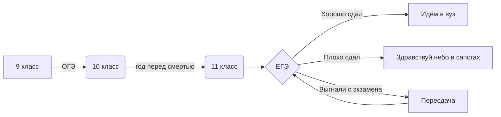
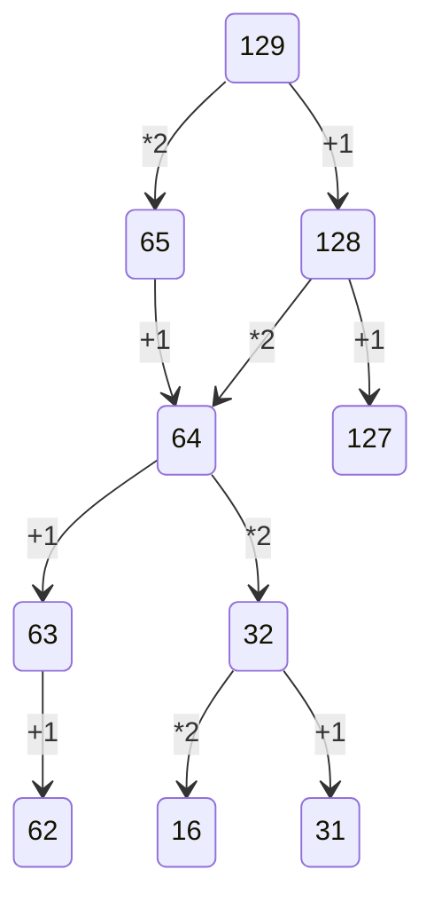

# Reposit142
# Шендеров Владислав Юрьвич
[

Код Хэмминга.ipynb - эта  программа нужна для выполнения кода Хэмминга

корявая викторина.py - это викторина на питоне

Логика python.py - Задание с логикой в Python

Логические операции.xlsx - Таблица с название логической операции и её значком, Таблица истинности для A ^ (не B) → C↔A (В Exel)

Таблица умножения и перевод.xlsx - Перевод из n-ичной системы исчисления в 10-чную, Таблица умножения для 8-ричной системы исчисления в Exel

морзянка.xlsx - Перевод слова с использованием обычного алфавита в слово с использованием алфавита морзе в Exel

морзянка на python.py - Перевод слова с использованием обычного алфавита в слово с использованием алфавита морзянки в Python

перевод в десятичную систему счисления на python.py - перевод числа из N-ичной системы исчисления в десятичную в Python

перевод из десятичной системы счисления в python.py - перевод числа из десятичной системы исчесления в 
N-ичную систему исчесления в Python

Таблица умножения.py - таблица умножения для систем исчисления от двоичной до десятичной включительно в Python

$$A \wedge A = A$$  

 
 $$\overline{E}^{2}_{1} = \sqrt{\frac{Fa^{x-1}}{(x-1)\cdot x}}+\alpha^{\frac{1}{2}}_1+\beta_1^\frac{2}{3}$$
 
 $$1+\tan^{2}\alpha = \frac{1}{\cos^{2}\alpha}$$
 
$$\left( x + \frac{1}{1+\frac{1}{x}} \right)^{\frac{2}{3}}$$

